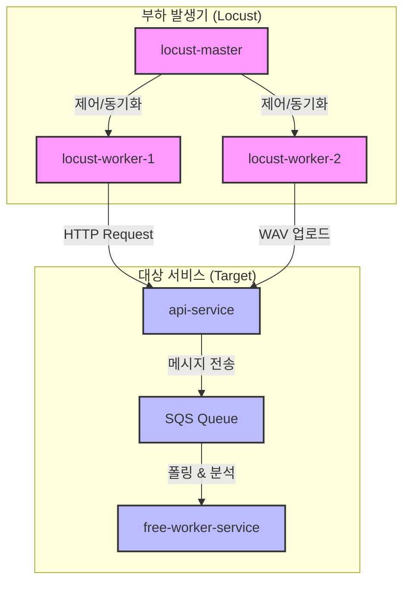

# Locust 분산 부하 테스트 모듈 (30-load-test)

이 모듈은 ECS Fargate 기반으로 분산 부하 테스트 도구인 **Locust** 클러스터를 배포하여 SecureVoice 시스템의 한계 성능을 검증하고, ECS Auto Scaling 및 복구 작동을 테스트합니다.

---

## 1. 아키텍처 및 역할 분담

부하 테스트 실행 시 ECS 클러스터 내부에 다음과 같이 **부하 발생기**와 **부하 대상 서비스**가 생성 및 동작하게 됩니다.



### 🅰️ 부하 발생기 (Locust 클러스터)
부하 테스트를 배포(`deploy-load-test.sh`)하면 새롭게 기동하는 태스크들입니다.
* **`securevoice-dev-locust-master`**
  * 부하 테스트 시나리오를 총괄하고 모니터링 웹 UI(포트 `8089`)를 제공합니다.
  * `--headless` 및 `--autostart` 옵션으로 배포 즉시 자동으로 테스트를 수행합니다.
* **`securevoice-dev-locust-worker`**
  * 마스터의 명령을 받아 실제 대용량 트래픽 및 오디오 업로드 부하를 대상 API로 전송하는 클라이언트들입니다.

### 🅱️ 부하 대상 서비스 (기존 웹/워커 애플리케이션)
원래 가동 중이던 우리의 비즈니스 서비스입니다.
* **`securevoice-dev-api-service`**: Locust의 API 호출 및 파일 업로드 부하를 받습니다.
* **`securevoice-dev-free-worker-service` / `securevoice-dev-paid-worker-service`**: API 요청으로 인해 SQS 대기열에 쌓인 메시지를 컨테이너가 폴링하여 가져가 실제 분석 처리를 진행합니다.

---

## 2. 오토스케일링(Auto Scaling) 연동 및 기동 원리

1. **부하 유입**: `locust-worker`가 API로 오디오 분석 요청을 보내면, API 서버는 SQS 대기열(`free-queue`)에 작업을 적재합니다.
2. **알람 발생**: 대기열의 메시지 수가 오토스케일링 기준치(예: 2개 이상)에 도달하면 CloudWatch 경보(`securevoice-free-queue-visible-high`)가 트리거됩니다.
3. **스케일 아웃 실행**: 스케일 아웃 정책에 의해 기존 `free-worker-service` 서비스의 **`desiredCount`(희망 태스크 수)**가 동적으로 상향됩니다 (예: 1대 ➔ 2대).
4. **PENDING 상태의 의미**: 
  * ECS는 기존에 구동 중이던 정상 태스크는 그대로 유지하고, 증가된 수만큼 **새로운 컨테이너 태스크를 추가로 프로비저닝**합니다.
  * 이때 새로 기동되는 추가 태스크들이 초기 구동 준비 상태인 **`PROVISIONING` ➔ `PENDING`** 단계를 거치게 되며, 준비가 끝나면 **`RUNNING`**으로 바뀌어 기존 태스크와 함께 부하를 처리합니다.

---

## 3. 사용법

### 1) 부하 테스트 배포 및 실행
현재 로그인되어 있는 AWS 기본(default) 프로필 자격 증명을 사용하여 부하 테스트 인프라를 배포합니다.
```bash
# 30-load-test 디렉터리로 이동
cd mzc-terraform/30-load-test

# AWS 기본 프로필을 지정하여 배포 실행 (ECR 로그인 및 이미지 빌드/푸시 자동 진행)
aws login --profile bya
export TARGET_HOST="http://securevoice-dev-api-alb-537121418.ap-northeast-2.elb.amazonaws.com"

AWS_PROFILE=default ./deploy-load-test.sh apply
```
* **동시 가상 사용자 수 변경**: `deploy-load-test.sh` 내부 설정을 통해 동시 사용자 수(`LOCUST_USERS=50`), 초당 유저 증가량(`SPAWN_RATE=5`), 실행 시간(`RUN_TIME=5m`) 등을 조율할 수 있습니다.

```bash
LOCUST_USERS=200 WORKER_COUNT=5 ./deploy-load-test.sh apply
```


### 2) 부하 테스트 인프라 삭제 (비용 방지)
테스트 결과를 확인한 뒤에는 불필요한 Fargate 리소스가 유지되어 비용이 청구되지 않도록 **반드시 삭제**해 주어야 합니다.
```bash
AWS_PROFILE=default ./deploy-load-test.sh destroy
```

---

## 💡 모듈 상세 가이드 (Why, What, How)

### 왜 필요한가? (Why)
* **한계 성능 검증**: 개발된 SecureVoice 서비스가 실제로 대량의 동시 오디오 분석 요청을 받았을 때 정상적으로 작동하는지, 시스템의 한계 지점과 병목 현상이 발생하는 구간을 파악하기 위해 필요합니다.
* **오토스케일링 및 복구력 검증**: 부하 증가에 따라 ECS Fargate 및 SQS가 설정된 규칙대로 스케일 아웃이 잘 유발되는지, 그리고 부하가 종료된 후 정상적으로 스케일 인(축소) 및 안정화되는지 실제 환경에서 직접 관측하기 위함입니다.

### 무슨 기능을 하는가? (What)
* **Locust 분산 부하 클러스터 구축**: 마스터 태스크 1개와 다수의 워커 태스크로 이루어진 분산 부하 생성기를 ECS Fargate 상에 배포합니다 (`ecs.tf`, `ecr.tf`).
* **실제 트래픽 모사**: 워커 노드들은 사전에 작성된 Locust 스크립트를 기반으로 API 서버에 WAV 파일 업로드 및 분석 요청을 지속적으로 보냅니다.
* **배포 자동화 스크립트 제공**: `deploy-load-test.sh` 스크립트를 통해 도커 이미지 빌드, ECR 푸시, 테라폼 적용(apply) 및 리소스 정리(destroy)까지 한 번에 자동 처리할 수 있습니다.

### 어떻게 사용하는가? (How)
* **초기 설정 및 실행**:
  1. `30-load-test` 디렉터리로 이동합니다.
  2. `./deploy-load-test.sh apply` 명령어로 로커스트 클러스터를 배포합니다.
  3. 배포 완료 후 출력되는 로드밸런서 주소와 포트 `8089`를 통해 Locust 웹 대시보드에 접속하여 테스트 현황을 시각적으로 모니터링할 수 있습니다.
* **테스트 정리**: 비용 낭비를 방지하기 위해 테스트 완료 후 반드시 `./deploy-load-test.sh destroy`를 실행하여 리소스를 완전히 해제합니다.