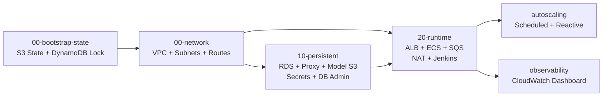
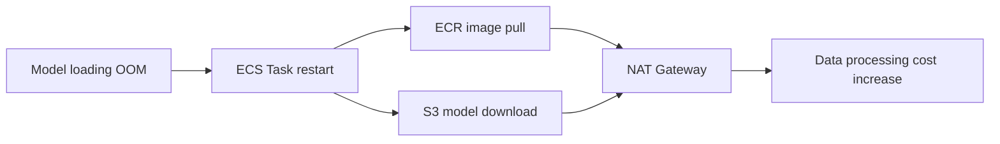

# SecureVoiceGuard Infrastructure

<p align="center">
  <strong>AWS ECS Fargate 기반 AI 음성 진위 판별 서비스의 인프라를 Terraform으로 구성한 프로젝트입니다.</strong>
</p>

<p align="center">
  
  
  
  
  
</p>

SecureVoiceGuard는 사용자가 업로드한 음성 파일을 AI 모델로 분석해 진짜 음성인지 위변조 음성인지 판별하는 서비스입니다. 이 저장소는 단일 서버에 섞여 있던 API, 추론, 파일 저장, 운영 기능을 AWS 관리형 서비스로 분리하고, 배포 가능한 인프라를 코드로 재현하는 데 초점을 맞췄습니다.

핵심은 **API와 AI 추론 작업을 SQS로 분리한 비동기 구조**, **무료/유료 워커의 독립 확장**, **Private Subnet과 VPC Endpoint를 이용한 보안·비용 최적화**, **CloudWatch와 Application Auto Scaling을 이용한 운영 자동화**입니다.

> `dev` 환경 기준 레포지토리

## Contents

- [Project Overview](#project-overview)
- [Architecture](#architecture)
- [Terraform Layers](#terraform-layers)
- [Key Design Decisions](#key-design-decisions)
- [My Contribution](#my-contribution)
- [Troubleshooting](#troubleshooting)
- [Security](#security)
- [Deployment](#deployment)
- [Repository Structure](#repository-structure)
- [Production Readiness](#production-readiness)

## Project Overview

### 문제 정의

기존 온프레미스 단일 서버 구조에서는 Web, API, AI Inference, 파일 저장이 한 서버에 집중되어 있었습니다. 요청이 몰리면 추론 작업이 API 응답을 지연시키고, 장애가 발생하면 전체 서비스가 영향을 받으며, 무료·유료 사용자의 처리 우선순위를 분리하기도 어려웠습니다.

### 해결 방향

| 기존 구조 | 개선 구조 |
| --- | --- |
| 단일 서버에 Web·API·Inference 혼재 | ECS Fargate의 API·Free Worker·Paid Worker 분리 |
| API 요청에서 AI 추론을 동기 처리 | SQS 기반 비동기 작업 처리 |
| 로컬 디스크에 파일·모델 저장 | S3에 Audio·Result·Model 저장 |
| 트래픽 증가 시 지연과 Timeout 발생 | Queue backlog 기반 Worker Auto Scaling |
| 무료·유료 요청이 같은 처리 경로 사용 | Free/Paid Queue 및 Worker 독립 운영 |
| 수동 상태 확인과 장애 대응 | CloudWatch Dashboard·Alarm·Runbook 기반 운영 |
| 서버 내부에 인증 정보 저장 | Secrets Manager와 IAM Role 기반 주입 |

### 구현 결과

- API 요청과 AI 추론 작업을 분리해, 긴 추론 시간과 API 응답 시간을 분리했습니다.
- Free/Paid 전용 SQS와 DLQ를 구성해 서비스 등급과 실패 메시지를 독립 관리했습니다.
- ECS Worker를 Queue 적체량과 메시지 대기 시간에 따라 자동 확장하도록 구성했습니다.
- RDS Multi-AZ, RDS Proxy, Private Data Subnet으로 데이터 계층의 가용성과 연결 안정성을 확보했습니다.
- DB 관리 서버에서 SSH와 Public IP를 제거하고 SSM Session Manager만 사용하도록 구성했습니다.
- 모델 반복 다운로드로 발생한 NAT Gateway 대량 과금의 원인을 분석하고 VPC Endpoint로 경로를 전환했습니다.
- API → SQS → Worker → S3/RDS로 이어지는 실제 추론 흐름과 `SUCCEEDED` 상태 전이를 검증했습니다.

## Architecture


<p align="center"><sub>팀 공통 발표 범위의 전체 서비스 아키텍처입니다. 이 저장소는 VPC 내부와 ALB, ECS, SQS, RDS, 운영 자동화 영역을 중심으로 관리합니다.</sub></p>

발표자료의 전체 시스템에는 CloudFront, WAF, Frontend S3와 별도 운영 연동도 포함됩니다. 이 저장소에서 Terraform으로 직접 생성하거나 조회하는 범위는 아래 다이어그램과 같습니다.


### Network Layout

| 구분 | AZ-a | AZ-c | 주요 리소스 |
| --- | --- | --- | --- |
| Public | `10.0.0.0/26` | `10.0.0.64/26` | ALB, NAT Gateway |
| Private App | `10.0.0.128/25` | `10.0.1.0/25` | API, Worker, Jenkins, DB Admin, Interface Endpoint |
| Private Data | `10.0.1.128/26` | `10.0.1.192/26` | RDS Primary/Standby |
| Reserved | `10.0.2.0/23` | - | 향후 Staging·추가 Worker·관리 서비스 확장 |

외부 요청은 Public ALB까지만 들어오며, API와 Worker에는 Public IP를 할당하지 않습니다. DB는 Private Data Subnet에 배치하고 RDS Proxy 또는 허용된 DB Admin Security Group을 통해서만 `3306` 포트에 접근합니다.


## Terraform Layers

상태 파일과 리소스 수명 주기를 한 덩어리로 관리하지 않고, 변경 빈도와 삭제 위험에 따라 계층을 분리했습니다.



| Layer | 역할 | 설계 의도 |
| --- | --- | --- |
| `00-bootstrap-state` | Terraform State S3, DynamoDB Lock | 협업 중 상태 충돌 방지와 State 버전 관리 |
| `00-network` | VPC, 6개 Subnet, IGW, Route Table | 네트워크 기반을 독립 수명 주기로 관리 |
| `10-persistent` | Model S3, RDS, RDS Proxy, Secrets, DB Admin, SSM Endpoint | 데이터 손실 위험이 큰 장기 리소스 보호 |
| `20-runtime` | ALB, ECS, SQS/DLQ, NAT, Runtime Endpoint, Jenkins | 배포와 교체가 잦은 실행 리소스 관리 |
| `autoscaling` | ECS Scalable Target, SQS Alarm, Schedule | 트래픽 패턴에 따른 Worker 수 자동 조절 |
| `observability` | CloudWatch 운영 Dashboard | ECS·SQS·RDS·ALB 핵심 지표 통합 확인 |

`10-persistent`와 `20-runtime`은 S3 Remote State output으로 연결됩니다. 배포 시 Terraform이 이전 계층의 endpoint와 ARN을 읽어 Task Definition을 구성하며, 실행 중인 ECS 컨테이너가 Terraform State를 읽지는 않습니다.

RDS와 Model S3에는 `prevent_destroy`, RDS에는 `deletion_protection`과 final snapshot 정책을 적용해 실수로 Runtime을 정리해도 데이터 계층이 함께 삭제되지 않도록 했습니다.

## Key Design Decisions

### 1. EKS 대신 ECS Fargate

이 프로젝트의 목표는 Kubernetes 자체 운영보다 API/Worker 분리, SQS 비동기 처리, IAM Task Role, Auto Scaling 같은 AWS 서비스 설계를 검증하는 것이었습니다. 서비스 수와 내부 통신 복잡도를 고려하면 EKS의 Cluster, Node Group, Ingress, RBAC 운영 비용이 과도하다고 판단했습니다.

ECS Fargate를 선택해 EC2 Worker Node 관리 없이 컨테이너별 CPU·Memory를 명시하고, ALB·ECR·CloudWatch·Application Auto Scaling과 AWS Native 방식으로 연결했습니다. 향후 서비스 수가 크게 늘고 GitOps, Service Mesh, Kubernetes 표준 운영이 필요해지는 시점에는 EKS 전환을 검토할 수 있습니다.

### 2. 동기 추론 대신 SQS 비동기 처리

AI 추론은 API 요청보다 처리 시간이 길고, 모델 로딩이나 재시도 때문에 지연 편차도 큽니다. API와 Worker를 직접 연결하면 Worker 장애가 API Timeout으로 전파됩니다. SQS를 사이에 두어 요청 수신과 추론 실행을 분리하고, Queue Depth 자체를 확장 지표로 활용했습니다.

### 3. Free/Paid 처리 경로 분리

하나의 Queue와 Worker Pool을 사용하면 무료 요청이 급증할 때 유료 요청도 함께 지연됩니다. Free/Paid Queue, Worker Service, DLQ, Scaling Policy를 각각 구성해 서비스 등급별 용량과 확장 한도를 독립적으로 제어했습니다.

| Policy | Free Worker | Paid Worker |
| --- | --- | --- |
| 기본 범위 | 1~2 Tasks | 1~10 Tasks |
| Scale-out 조건 | Visible Message `>= 2` | Visible Message `>= 3` 또는 Oldest Age `>= 60s` |
| Scale-out 단위 | `+1` | `+2` |
| Scale-out Cooldown | 180초 | 180초 |
| Scale-in 조건 | Queue empty 10분 | Queue empty 10분 |
| Scale-in 단위 / Cooldown | `-1` / 300초 | `-1` / 300초 |
| 평일 09:00~18:00 KST | 2 Tasks 고정 | 최소 5, 최대 10 Tasks |

예측 가능한 업무 시간대에는 Scheduled Scaling으로 사전 용량을 확보하고, 돌발 적체에는 SQS Alarm 기반 Reactive Scaling으로 대응하는 Hybrid 전략입니다.

### 4. NAT Gateway와 VPC Endpoint 병행

Private App Subnet의 기본 인터넷 경로는 NAT Gateway로 유지하되, 대용량·반복 통신이 발생하는 AWS 서비스는 VPC Endpoint로 전환했습니다.

- S3는 Gateway Endpoint를 사용해 모델과 오디오 전송이 NAT를 우회합니다.
- ECR API/DKR, CloudWatch Logs, Secrets Manager, SSM, EC2Messages, SSMMessages, STS는 Interface Endpoint와 Private DNS를 사용합니다.
- Endpoint가 없는 외부 패키지 저장소나 기타 Public API만 NAT를 fallback 경로로 사용합니다.

### 5. RDS 직접 연결 대신 RDS Proxy

API와 Worker Task 수가 늘어날 때 각 컨테이너의 DB 연결이 한꺼번에 증가할 수 있습니다. RDS Proxy의 Connection Pool을 통해 DB 연결 폭주를 완화하고, ECS에는 RDS endpoint가 아닌 Proxy endpoint를 전달했습니다.

RDS는 MySQL 8.0, Multi-AZ, gp3 20GB(최대 100GB), 7일 자동 백업, Private Data Subnet으로 구성했습니다. 애플리케이션 계정은 Master 계정과 분리하고 `SELECT`, `INSERT`, `UPDATE`, `DELETE` 권한만 부여합니다.

## My Contribution

**서기표 - Observability, Auto Scaling, AI 운영 자동화 및 비용 트러블슈팅**

팀 공통 발표 구간에서는 전체 요구사항, AWS 아키텍처, ECS/SQS 비동기 처리 흐름과 시연을 함께 설명했습니다. 개인 발표 구간에서는 단순히 지표를 보는 수준을 넘어 **관측 → 확장 → 알림 → 대응**으로 이어지는 운영 판단 자동화를 담당했습니다.

| 구분 | 담당 내용 | 저장소에서 확인 가능한 결과 |
| --- | --- | --- |
| Observability | ECS·SQS·RDS·ALB 핵심 지표 정의 및 통합 | `observability/` CloudWatch Dashboard JSON |
| Reactive Scaling | Queue Depth와 Oldest Message Age 기반 확장 | `autoscaling/sqs-scaling.tf` |
| Scheduled Scaling | 평일 업무 시간 사전 Worker 확보 | `autoscaling/scheduled-scaling.tf` |
| FinOps / Network | NAT 과금 원인 분석 및 Endpoint 전환 | `10-persistent/endpoints.tf`, `20-runtime/endpoints.tf` |
| Resource Tuning | AI 모델 OOM 원인 분석, Worker 4 vCPU / 8GB 조정 | `20-runtime/ecs.tf` |
| Incident Response | Alarm, AI 요약, Slack, Runbook 연계 흐름 설계·검증 | 발표자료 및 운영 시나리오 |

CloudWatch와 Terraform 저장소에는 Dashboard와 Auto Scaling 핵심 구현이 포함되어 있습니다. Prometheus/Grafana Custom Metric, Bedrock 기반 AI 장애 요약, Slack 알림은 프로젝트 운영 연동·발표 범위이며 이 저장소의 Terraform 리소스로는 포함하지 않았습니다. 공개 포트폴리오에서도 구현 코드와 확장 설계를 명확히 구분했습니다.

## Troubleshooting

### Worker OOM과 NAT Data Processing 비용 급증

**현상**

- Worker가 약 1.2GB 규모의 AI 모델을 로딩하는 과정에서 메모리 부족으로 종료되었습니다.
- ECS Service가 Task를 다시 시작할 때마다 컨테이너 이미지와 모델을 반복 다운로드했습니다.
- Private Subnet의 S3/ECR 트래픽이 NAT Gateway를 통과하면서 이틀간 약 6TB의 Data Processing과 약 400달러 규모의 비용이 발생했습니다.

**원인 흐름**



**조치**

1. Worker Task를 `4096 CPU / 8192 MiB`로 조정해 모델 로딩 중 OOM을 제거했습니다.
2. S3 Gateway Endpoint를 Private App Route Table에 연결했습니다.
3. ECR API/DKR, CloudWatch Logs, Secrets Manager, SSM, STS Interface Endpoint를 추가했습니다.
4. CloudTrail의 `vpcEndpointId`, NAT Gateway metric, ECS log를 함께 확인해 실제 경로 전환을 검증했습니다.

**결과**

- Worker가 안정적으로 유지되어 무한 재시작과 모델 재다운로드가 멈췄습니다.
- S3 모델 다운로드가 NAT Gateway를 우회했고, NAT 처리량은 수 KB 수준으로 감소했습니다.
- SQS 수신 → S3 다운로드 → AI 추론 → Result 업로드 → DB `SUCCEEDED` 갱신 → 메시지 삭제의 End-to-End 흐름을 확인했습니다.

이 문제는 단순히 Endpoint 하나를 추가하는 것으로 끝나지 않았습니다. **애플리케이션 메모리 부족 → 컨테이너 재시작 → 네트워크 경로 반복 사용 → 클라우드 비용 증가**로 이어진 계층 간 장애였고, 로그·메트릭·네트워크 경로를 함께 봐야 원인을 찾을 수 있었습니다.

## Security

| 영역 | 적용 내용 |
| --- | --- |
| Network Isolation | ALB만 Public Subnet, API/Worker/DB/Admin은 Private Subnet 배치 |
| Security Group | ALB → API:8000, App/Proxy/Admin → RDS:3306의 허용 경로 제한 |
| Admin Access | DB Admin과 Jenkins에 Public IP·SSH Inbound 없이 SSM 사용 |
| Secret Management | RDS Master 비밀번호는 RDS-managed Secret, App 계정은 별도 Secret 사용 |
| Least Privilege | API는 S3 Put/Get·SQS Send, Worker는 S3 Get/Put·SQS Receive/Delete로 역할 분리 |
| Storage | Model S3 Public Access Block, KMS 암호화, RDS Storage Encryption |
| State | S3 암호화·Versioning과 DynamoDB Lock으로 Terraform State 보호 |
| Data Protection | RDS Multi-AZ, 7일 Backup, Final Snapshot, Deletion Protection |

DB App 계정 생성은 Terraform에 비밀번호 값을 넣지 않고 SSM Run Command로 수행합니다. Bootstrap Script가 Secrets Manager에서 Master Secret을 읽고 App 비밀번호를 생성한 뒤, MySQL 계정과 최소 DML 권한을 설정합니다. 실제 비밀번호는 Terraform State나 SSM 출력에 남기지 않습니다.

자세한 절차는 [DB Account Bootstrap Runbook](docs/db-account-bootstrap-runbook.md)에서 확인할 수 있습니다.

## Deployment

### Prerequisites

- Terraform `>= 1.6.0`
- AWS CLI와 유효한 AWS 자격 증명
- 배포 대상 계정에 필요한 IAM 권한
- 기존 ECR Repository와 Audio S3 Bucket
- Route 53 Public Hosted Zone
- API·Worker Container Image의 Git SHA Tag

민감한 값이 들어가는 `*.tfvars`, Terraform State, `.terraform/`은 Git에 포함하지 않습니다. 실제 계정 ID, Secret ARN, DB endpoint, 비밀번호를 README나 예제 파일에 직접 기록하지 마세요.

### Apply Order

```bash
# Backend와 Provider가 같은 AWS 자격 증명을 사용하도록 설정합니다.
export AWS_PROFILE=<profile>
aws sts get-caller-identity

# 1. Remote state backend
cd 00-bootstrap-state
terraform init
terraform plan -var='aws_profile=<profile>'
terraform apply -var='aws_profile=<profile>'

# 2. Network foundation
cd ../00-network
terraform init
terraform plan -var='aws_profile=<profile>'
terraform apply -var='aws_profile=<profile>'

# 3. Persistent data layer
cd ../10-persistent
terraform init
terraform plan -var='aws_profile=<profile>'
terraform apply -var='aws_profile=<profile>'
```

`10-persistent` 적용 후 [DB Account Bootstrap Runbook](docs/db-account-bootstrap-runbook.md)에 따라 SSM 문서를 한 번 실행해 App DB 계정과 Secret 값을 구성합니다.

```bash
# 4. Runtime layer
cd ../20-runtime
terraform init
terraform plan \
  -var='aws_profile=<profile>' \
  -var='api_image_tag=<git-sha>' \
  -var='worker_image_tag=<git-sha>'
terraform apply \
  -var='aws_profile=<profile>' \
  -var='api_image_tag=<git-sha>' \
  -var='worker_image_tag=<git-sha>'

# 5. Worker autoscaling
cd ../autoscaling
terraform init
terraform plan -var='aws_profile=<profile>'
terraform apply -var='aws_profile=<profile>'

# 6. CloudWatch dashboard
cd ../observability
terraform init
terraform plan -var='aws_profile=<profile>'
terraform apply -var='aws_profile=<profile>'
```

배포 후에는 ALB Target Health, ECS Service의 `running/desired`, SQS Queue Depth, RDS Proxy target 상태, CloudWatch Log Stream을 순서대로 확인합니다.

## Repository Structure

```text
.
├── 00-bootstrap-state/        # S3 Terraform State + DynamoDB Lock
├── 00-network/                # VPC, 2AZ Subnets, IGW, Route Tables
├── 10-persistent/             # RDS, RDS Proxy, Model S3, Secrets, DB Admin
│   └── scripts/               # SSM DB app-user bootstrap script
├── 20-runtime/                # ALB, Route 53, ECS, SQS/DLQ, NAT, Jenkins
├── autoscaling/               # Scheduled + SQS metric based scaling
├── observability/             # CloudWatch Dashboard as code
│   └── dashboards/
└── docs/
    ├── images/                # README architecture assets
    └── db-account-bootstrap-runbook.md
```

## Production Readiness

현재 저장소는 `dev` 환경에서 아키텍처와 운영 흐름을 검증한 결과물입니다. 프로덕션 전환 시 다음 항목을 우선 개선할 계획입니다.

- ALB HTTP Listener를 ACM 인증서 기반 HTTPS로 전환하고 HTTP는 HTTPS로 Redirect
- RDS Proxy의 TLS 필수 설정과 애플리케이션 DB TLS 연결 검증
- Terraform 코드에 고정된 Account ID, KMS Key, Hosted Zone, Backend 값을 변수 또는 환경별 설정으로 분리
- JWT Secret의 개발용 초기 값을 제거하고 배포 외부에서 생성·Rotation
- CloudWatch Dashboard의 RDS/ALB Dimension을 Terraform output 기반으로 동적 생성
- SQS Interface Endpoint 추가 여부를 비용과 시간당 Endpoint 요금 기준으로 재평가
- `autoscaling`, `observability` State도 Remote Backend로 통합
- `terraform fmt`, `validate`, `tflint`, `tfsec`를 CI Pipeline에 추가
- Multi-AZ Failover, DLQ Redrive, Worker Graceful Shutdown을 정기 GameDay 시나리오로 검증

## Team

| 이름 | 담당 영역 |
| --- | --- |
| 서기표 | Observability, Auto Scaling, AI 운영 자동화, FinOps |
| 김재환 | RDS Architecture, Multi-AZ, RDS Proxy, DB 운영 |
| 김태경 | CI/CD, 무중단 배포 |
| 백유안 | Backup/Restore, DLQ, 운영 안정성 |
| 박민규 | KMS, WAF, IAM, 보안 탐지·자동 대응 |

---

이 프로젝트는 리소스를 나열하는 데서 끝나지 않고, **AI 서비스의 처리 특성을 기준으로 네트워크·컴퓨팅·데이터·운영 계층을 연결하고 실제 장애와 비용 문제를 검증한 과정**을 담고 있습니다.
