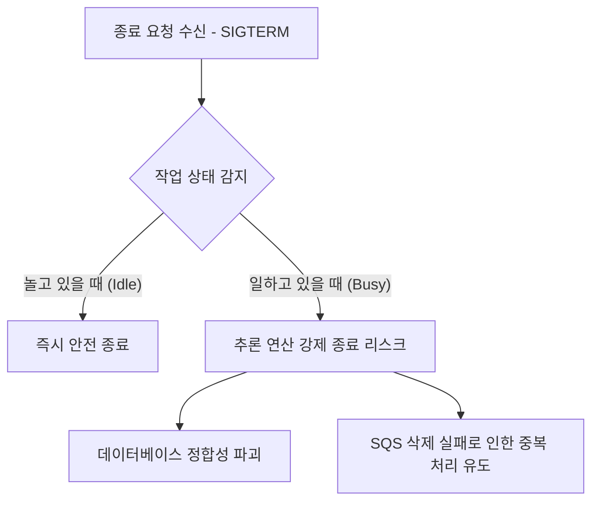
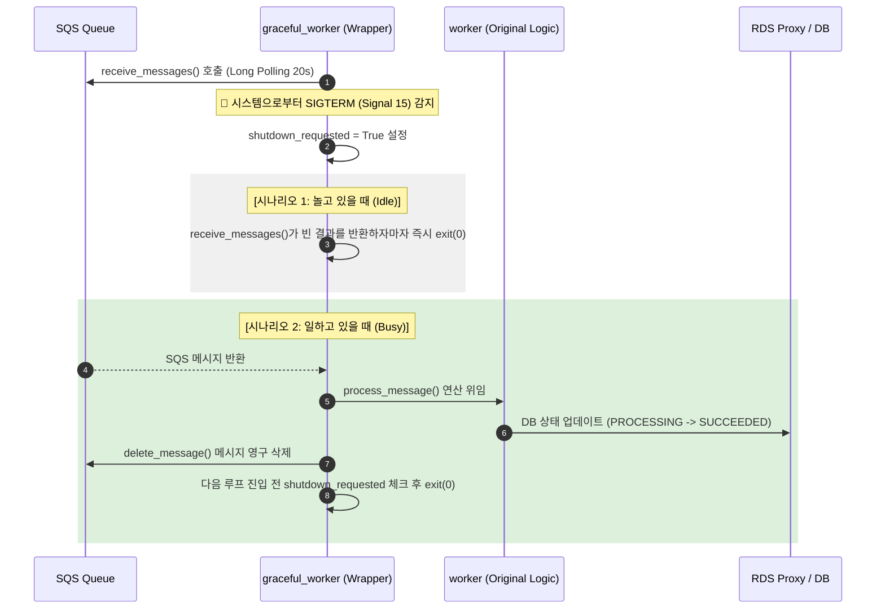

# 🚀 ECS Fargate AI Worker Graceful Shutdown

이 모듈은 ECS Fargate 컨테이너가 롤링 배포(Rolling Update) 또는 오토스케일인(Scale-In)에 의해 종료 요청(`SIGTERM`)을 받았을 때, 가동 중이던 AI 추론 프로세스가 강제로 끊겨 발생할 수 있는 **데이터 누수**와 **SQS 메시지 중복 처리**를 원천 방지하기 위해 설계되었습니다.

---

## 📌 왜 Graceful Shutdown이 필요한가? (문제 정의)



1. **데이터 유실 리스크**: 대량의 음성 파일을 Deepfake 탐지 모델로 추론(통상 수 초 소요)하는 중간에 프로세스가 갑자기 종료되면 분석 결과가 정상 저장되지 못합니다.
2. **이중 연산 리스크**: 메시지 수신 후 처리가 완료되지 않고 죽으면 SQS 큐에 메시지가 그대로 남게 됩니다. 다른 워커가 이 메시지를 처음부터 다시 재처리하게 되어 불필요한 GPU/CPU 낭비가 발생합니다.

---

## 🛠️ 아키텍처 및 동작 시퀀스

`graceful_worker.py`는 오리지널 `worker.py`를 감싸는 래퍼(Wrapper) 스크립트로 동작하며, 아래와 같은 시퀀스로 우아하게 종료를 처리합니다.



---

## ⚙️ 핵심 설정값 (Configuration Parameters)

동작을 보장하기 위해 인프라와 애플리케이션에 상호 보완적인 타겟 타임아웃들이 매핑되어 있습니다.

| 설정 구분 | 파라미터명 | 설정값 | 상세 역할 |
|:---|:---|:---:|:---|
| **AWS ECS** | `stopTimeout` | **30초** *(기본값)* | Fargate가 컨테이너에 `SIGTERM`을 날린 뒤, 자진 종료하지 않을 시 `SIGKILL`로 강제 격리하는 최장 대기 시간 |
| **AWS SQS** | `visibility_timeout` | **300초 (5분)** | 메시지 점유 시 다른 워커에게 중복 노출되지 않도록 숨겨 두는 시간 (추론 제한시간) |
| **AWS SQS** | `receive_wait_time` | **20초** | SQS에 메시지가 없을 때 커넥션을 대기 상태로 유지하는 Long Polling 설정값 |
| **Python App** | `max_number` | **1개** | 배치 처리 단위를 1개로 제한하여 정밀하고 빠른 Graceful 탈출이 가능하도록 유도 |

---

## 📂 핵심 소스 코드 설명

* [graceful_worker.py](graceful_worker.py): 
  * `signal.signal` 핸들러를 등록해 `SIGTERM` 및 `SIGINT`를 즉시 가로챕니다.
  * `SQSClient.receive_messages`를 **Monkey-Patching**하여, 대기 상태(`Long Polling`) 중이거나 메시지 수신 직후 신호가 오면 프로세스를 정상 자진 종료(`sys.exit(0)`)시킵니다.
* [main.tf](main.tf): Graceful Shutdown 테스트 환경 구성을 위한 Fargate Task Definition 및 IAM 역할 정의 파일입니다.

---

## 🧪 검증 방법 (Verification)

1. **로컬/테스트 환경 부하 주입**: `locustfile_free.py` 등을 이용하여 ECS 환경에 실시간 대량의 음성 탐지 요청을 주입합니다.
2. **강제 중지 명령 전달**: 워커가 한창 딥페이크 분석을 연산하고 있을 때 AWS CLI를 통해 타겟 Fargate Task를 정지시킵니다.
   ```bash
   aws ecs stop-task --cluster securevoice-dev-cluster --task <TASK_ID>
   ```
3. **결과 로그 확인**: CloudWatch 로그에서 다음과 같이 연산을 끝까지 마무리한 후 자진 퇴근(종료)하는 로그를 검증합니다.
   ```plain
   [GRACEFUL] Signal 15 received. Requesting graceful shutdown...
   [WORKER][Request-1029] Processing deepfake detection model...
   [WORKER][Request-1029] db status updated: SUCCEEDED
   [WORKER][Request-1029] sqs message deleted successfully
   [GRACEFUL] Shutdown requested before receive_messages. Exiting worker gracefully.
   ```
